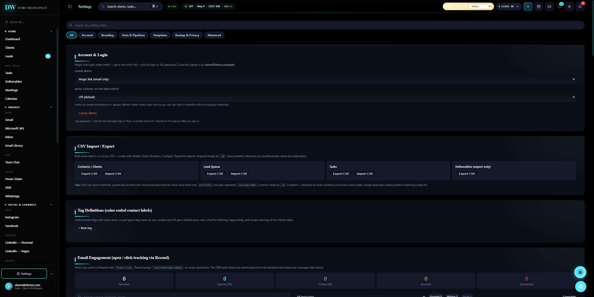
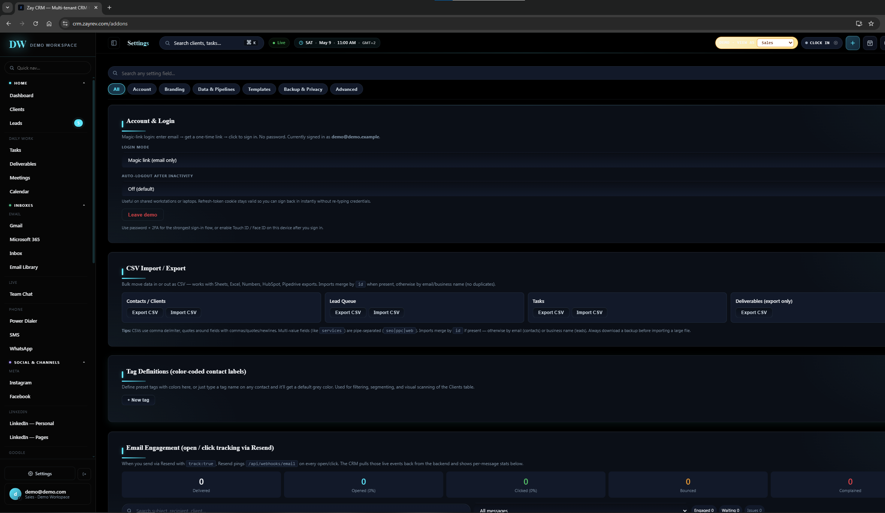
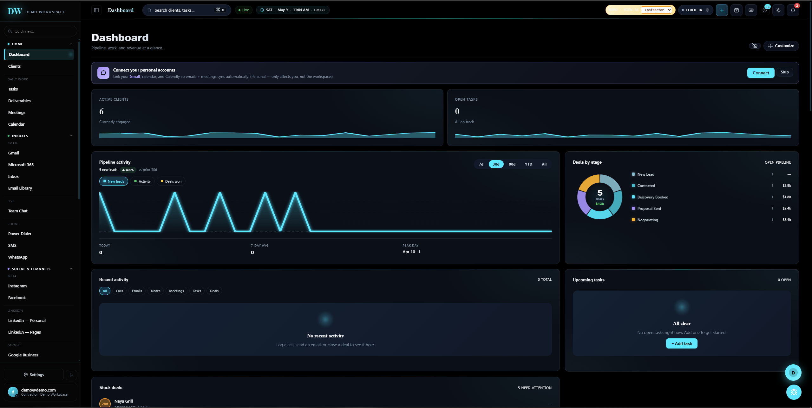
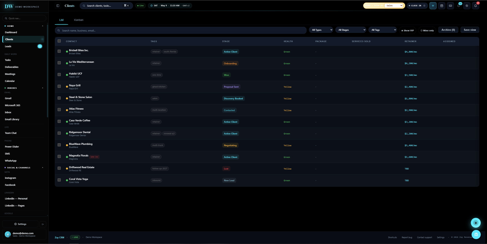
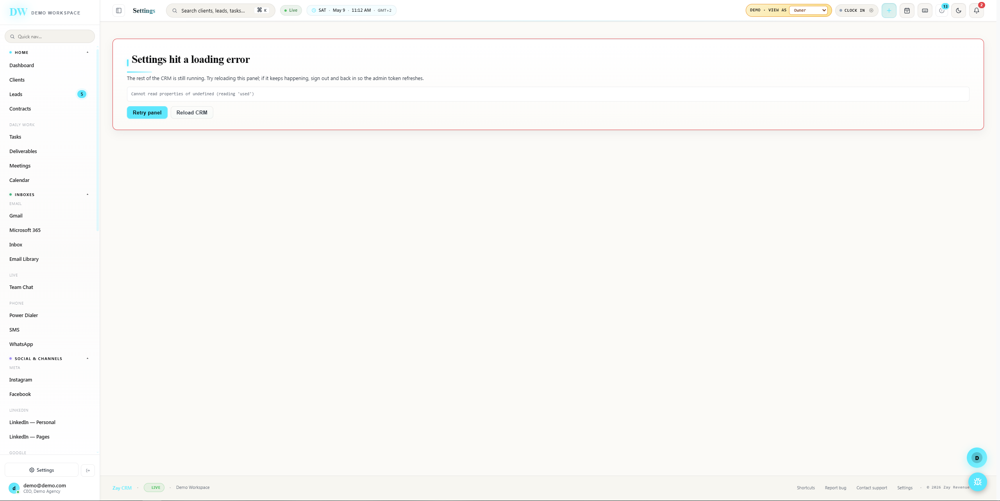
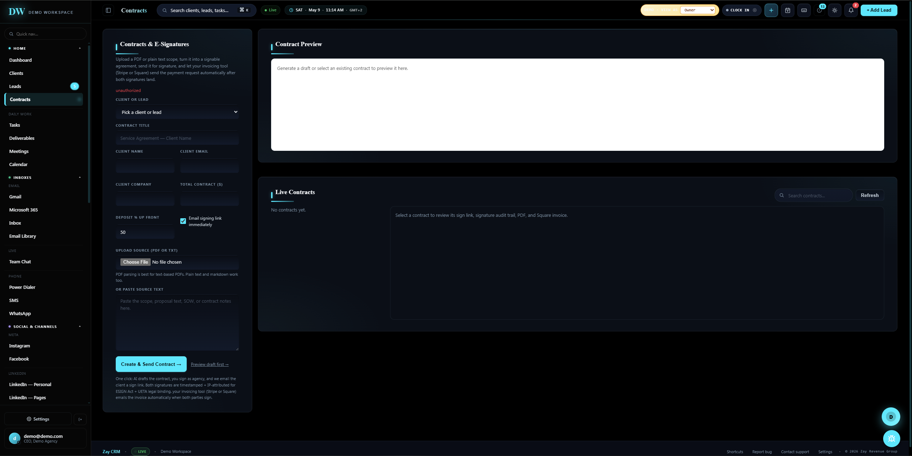
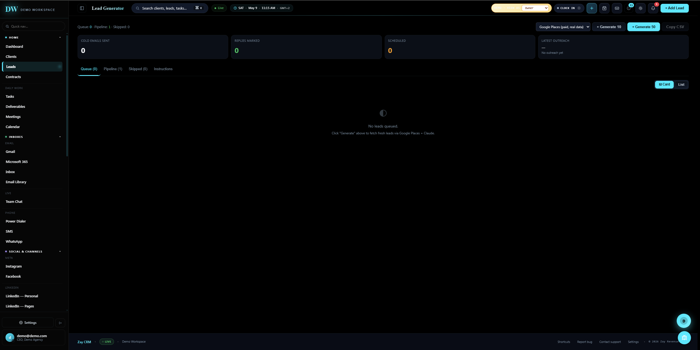

# Manual QA Report — Zay CRM Demo App

## Project

CRM demo web application  
Tested URL: `https://crm.zayrev.com/?demo=1`

## Testing Scope

Manual testing across multiple demo roles:

- Owner
- Manager
- Sales
- Contractor

Testing focused on:

- Role-based visibility and permissions
- Direct hidden URL access
- Dashboard and client data exposure
- Sidebar and command-palette navigation
- Settings/admin workflows
- Core CRM workflows
- Responsive behavior on standard mobile and desktop-laptop widths
- Keyboard behavior 
- Error states

## Environment
**Browser/OS:** Chrome on Windows  
**Viewports tested:**
- Desktop, including around 1280px width
- Mobile 375px width

---

# Summary

During testing, I found several issues across role-based access, route permissions, dashboard data exposure, Settings/admin workflows, responsive layout, and core CRM workflows.
The main problems were related to lower-permission roles being able to see or open areas that should normally be restricted, such as admin, reporting, integration, privacy, and financial sections. I also found cases where hidden pages could still be accessed through direct URLs, workspace data was exposed between roles, Owner/admin pages showed raw errors, lead queue data was lost or left inconsistent, and some topbar actions became unreachable on common screen sizes.
I prioritized the top 10 findings because they have the biggest impact on permission trust, restricted data visibility, core CRM workflows, and overall usability. Smaller findings are listed separately so they can still be reviewed without making the main report harder to follow.
I did not report expected demo/API limitations as standalone bugs. For example, I did not count unavailable SMS, real calls, OAuth redirects, Stripe checkout, or real backend snapshots as bugs by themselves. I only reported those areas when the UI showed raw errors, missing expected demo UI, confusing states, or blocked something that should still be testable in the demo. I prioritized issues that were reproducible, role-related, or likely to affect trust in the demo.

---

# Top 10 Findings

---

## 1. Sales and Contractor can access restricted Settings/admin panels

**Severity:** Blocker  
**Category:** Role-based access/Permissions  
**Roles affected:** Sales, Contractor  
**Viewport:** Desktop and Mobile 375px  

### Steps to reproduce

1. Open `https://crm.zayrev.com/?demo=1`.
2. Switch role to `Sales` or `Contractor`.
3. Open `Settings`.
4. Review visible panels and available actions.

### Expected

Sales users should only have access to limited personal or account settings.
Contractor users should have even more restricted access and should only see very basic personal settings.
Lower-permission roles should not be able to view or access workspace/admin areas, including integrations, client portal links, role permissions, custom fields, workflow triggers, inbound email, data/privacy settings, export/import options, or team/member controls.

### Actual
Sales and Contractor users can see several restricted Settings areas and controls that should not be available to lower-permission roles. This includes CSV import/export options, Client Portal Links with visible Generate buttons, Data & Privacy settings, Role & Permissions, Team Members, Send Invite, Integrations, Google Business Profile, LinkedIn Company Page, Custom Fields, Workflow Triggers, Inbound Email, Email & Prompt Templates, AI Assistant workspace context, Saved Replies, and account deletion or data download controls.
Contractor access is especially concerning because this role can also see enabled admin-style actions such as + Add Custom Field, + Add Workflow, Send Invite, Download my data, and Delete my account.

### Why it matters

This is risky because Sales/Contractor users can see settings that look admin-only. Even if some actions fail later, the UI still exposes restricted areas and makes the role permissions unreliable.

### Suggested fix

- Split Settings into Personal Settings and Workspace/Admin Settings.
- Gate each Settings page by role before it loads.
- Gate each individual Settings section and action inside the page.
- Add backend or mutation-level permission checks so restricted actions cannot be triggered through hidden routes or direct URLs.
- Do not rely only on hiding buttons or sidebar links.

---

## 2. Direct URL access loads restricted admin/settings content for Sales

**Severity:** Blocker  
**Category:** Route-level permissions  
**Role affected:** Sales  
**Viewport:** Desktop  

### Steps to reproduce

1. Open the demo app.
2. Switch role to `Sales`.
3. Navigate directly to `https://crm.zayrev.com/addons`.
4. Observe the loaded page.

### Expected

Sales should be blocked, redirected, or shown only Sales-level allowed content. Billing, add-ons, workspace settings, and admin surfaces should not load.

### Actual

The /addons URL loads a Settings/admin surface for the Sales role, even though this area should appear restricted. From this page, Sales can see multiple admin-level sections and controls, including CSV import/export, client portal token generation, Data & Privacy, Role & Permissions, team/member invite controls, Integrations, Custom Fields, and Workflow Triggers. 

### Why it matters

Hidden navigation is not sufficient access control. A lower-permission user can bypass the sidebar by opening a restricted URL directly.

### Suggested fix

Add permission checks to all admin-related pages, including /addons, /billing, /settings, and any other admin/settings routes. If a lower-permission user tries to open one of these pages directly, the app should either redirect them back to the Dashboard or show a clear “Not authorized” message.
The same permission rules should also be used consistently across sidebar links, command palette results, and route guards, so restricted pages are hidden and blocked in the same way everywhere.

---

## 3. Sales and Contractor navigation exposes restricted reporting/growth/admin areas

**Severity:** Major  
**Category:** Navigation/Role visibility  
**Roles affected:** Sales, Contractor  
**Viewport:** Desktop and Mobile 375px  

### Steps to reproduce

1. Open the demo app.
2. Switch to `Sales`.
3. Inspect the sidebar.
4. Open `Ctrl+K` and review available page results.
5. Switch to `Contractor`.
6. Inspect the sidebar and command palette again.
7. Repeat on mobile using the hamburger menu.

### Expected

Sales should not see pages or sections meant for higher-permission users, such as reports, financial surfaces, workspace admin settings, broad integrations, or growth/configuration pages.

Contractor should have even more limited access and should only see information related to own/assigned work, such as own tasks, deliverables, meetings, and work status.

### Actual

Sales and Contractor users can see many broad sidebar sections that appear to be intended for higher-permission or admin users. These include areas such as Reports, Custom Dashboards, Marketing, Referrals, HR, Projects, Integrations, Google Business, Google Drive, LinkedIn Pages, Meta, Zapier, Social Scheduler, Inbound Leads, Threads, Auto-responders, Ads Insights, Ad Campaigns, and Admin / Tickets.
This makes the lower-permission roles look like they have access to workspace-wide, marketing, reporting, integration, and admin-level features, even if some of those areas may not fully work after opening them.
The same issue also appears in the command palette, where Referrals is shown as a page result for both Sales and Contractor users.
### Why it matters

Restricted surfaces should not be discoverable through navigation or global search. Even if some pages are blocked later, exposing them in the sidebar or command palette weakens role-based access expectations and creates confusion.

### Suggested fix

- Generate sidebar, mobile menu, and command-palette results from the same role permission matrix.
- Hide pages from navigation if the current role cannot access them.
- Keep route guards in place so restricted pages are blocked even if opened directly.

---

## 4. Contractor dashboard exposes workspace pipeline and financial data

**Severity:** Major  
**Category:** Data visibility/Dashboard  
**Role affected:** Contractor  
**Viewport:** Desktop  

### Steps to reproduce

1. Switch role to `Contractor`.
2. Open Dashboard.
3. Review dashboard widgets and KPI cards.

### Expected

Contractor should only see dashboard information related to their own assigned work, such as assigned tasks, assigned deliverables, own meetings, deadlines, and work status.

### Actual

The Contractor role can see workspace-level dashboard data that appears too broad for this permission level. This includes the number of active clients, pipeline activity, revenue-related information, deals by stage and value, client and lead names, lead sources, win rate, AI Lead Scorer data, and the conversion funnel.
This exposes business-wide CRM, sales, and performance information to a role that should likely only have access to limited personal or task-specific data.
### Why it matters

Contractors should not have access to company-wide business information. This exposes information outside the contractor’s assigned work and breaks role-based access expectations.

### Suggested fix

Replace the current Contractor dashboard with a more limited “My Work” dashboard that only shows information relevant to that user. For this role, the dashboard should focus on assigned tasks, assigned deliverables, upcoming or owned meetings, deadlines, and personal work status.
Workspace-wide sales and reporting widgets should be removed for Contractor users. This includes revenue, pipeline activity, deal values, lead sources, win rate, AI Lead Scorer data, and conversion funnel metrics.
Dashboard data should also be filtered by role before it is sent to the client, so lower-permission users cannot receive or inspect data they should not have access to.

---

## 5. Sales dashboard exposes financial/reporting data

**Severity:** Major  
**Category:** Data visibility/Dashboard  
**Role affected:** Sales  
**Viewport:** Desktop  

### Steps to reproduce

1. Switch role to `Sales`.
2. Open Dashboard.
3. Review visible widgets.

### Expected

Sales users should not be able to see sensitive financial or company-wide business data. This includes monthly recurring revenue, total revenue, financial performance numbers, top-paying clients, full workspace reports, broad sales pipeline data, and deal values that are outside of their assigned scope.
For the Sales role, the dashboard and reports should only show sales information that is directly relevant to the user’s assigned work.
### Actual

Some of the main financial cards are hidden for the Sales role, but Sales users can still see broad company-wide dashboard data that appears outside their expected scope.
This includes pipeline activity, a revenue section, deals grouped by stage with dollar amounts, stuck deals with dollar values, win rate, lead sources, AI Lead Scorer data, the conversion funnel, activity heat map, and other workspace-style activity widgets.
Because of this, the Sales dashboard still exposes business-wide sales and performance information, even though the role should only see data related to assigned work.
### Why it matters

Only hiding the top financial cards is not enough. Sales can still infer financial and reporting information through lower dashboard widgets.

### Suggested fix
Apply Sales role permissions across the entire Dashboard, not only to the top KPI cards. The Sales dashboard should only show information related to that user’s assigned work, such as assigned clients, assigned deals, tasks, and relevant activity.
Company-wide dashboard widgets should be hidden for Sales users, especially sections related to revenue, reporting, pipeline-wide activity, deal values, conversion data, lead scoring, and workspace-level performance metrics.
Restricted financial and reporting data should also be filtered before it is sent to the client, so Sales users cannot access data that is outside their role or assigned scope.

---

## 6. Sales can see all clients and retainer values instead of assigned clients only

**Severity:** Major  
**Category:** Data visibility/Clients  
**Role affected:** Sales  
**Viewport:** Desktop  

### Steps to reproduce

1. Switch role to `Sales`.
2. Open Clients.
3. Review the client list.

### Expected

Sales should see assigned clients only.

### Actual

Sales users can see the full client table instead of only the clients assigned to them. This includes client records such as Brickell Bites, La Vie Mediterranean, Habibi UCF, Naya Grill, Steel & Stone, and Atlas Fitness.
Sales users can also see financial retainer values for these clients, even though some of the clients may not be assigned to their scope. This exposes client and revenue-related information that should likely be limited based on role and assignment.
### Why it matters

Sales users can access client and revenue information outside their assigned ownership. This exposes the full client list, client names outside their scope, client payment levels, and wider business performance information.

### Suggested fix

For the Sales role, the Clients page should be filtered so users only see clients assigned to them or clients they are allowed to work with.
Financial columns, such as retainer amounts, should be hidden unless the Sales role is explicitly allowed to view that information.
This filtering should happen on the backend/API before the data is sent to the frontend, not only through UI hiding, so restricted client and financial data is not exposed to unauthorized roles.

---

## 7. Owner Settings crashes with raw JavaScript error and Retry does not recover

**Severity:** Major  
**Category:** Settings/Admin workflows  
**Role affected:** Owner  
**Viewport:** Desktop  

### Steps to reproduce

1. Open the demo app as Owner.
2. Toggle the theme using the topbar theme button.
3. Open Settings.
4. Click `Retry panel`.

### Expected

Settings should render normally in both light and dark mode. If a panel fails, `Retry panel` should recover it or show a clear user-facing fallback state.

### Actual

Settings shows:

`Settings hit a loading error`

with raw error text:

`Cannot read properties of undefined (reading 'used')`

Clicking `Retry panel` leaves the same error.

### Why it matters

Settings is a core Owner/admin surface. This crash blocks access to multiple expected admin areas, including Integrations, Backup & Restore, and Audit Log / Member Activity. The raw JavaScript error also looks developer-facing rather than user-facing.

### Suggested fix

Add checks for missing or undefined Settings usage/state values before rendering the page. One broken or missing value should not cause the entire Settings page to fail.
Settings panels should be isolated from each other, so if one section fails, the rest of the Settings page can still load normally.
The Retry panel button should actually reload the failed section or reset the broken state. Raw JavaScript errors should also be replaced with a clear, user-friendly recovery message.

---

## 8. Owner Contracts page shows raw `unauthorized` message

**Severity:** Major  
**Category:** Error state/Owner workflow  
**Role affected:** Owner  
**Viewport:** Desktop  

### Steps to reproduce

1. Switch role to `Owner`.
2. Open `Contracts` from the sidebar.
3. Inspect the page header and contract form.
4. Click `Create & Send Contract`.

### Expected

Owner should have full access to the Contracts & E-Signatures page, including creating contracts, sending contracts, and viewing contract audit information.

### Actual

Owner can open the Contracts & E-Signatures page, but the page shows an `unauthorized` message. The contract form still loads, but when Owner clicks `Create & Send Contract`, another unauthorized message appears as a popup.

### Why it matters

Owner should have full contract access. Showing the form but blocking the action is confusing because the page appears usable, but the main workflow fails only after submission.

### Suggested fix

Allow the Owner role to use the full Contracts flow, including creating contracts, sending them, and viewing audit-related actions.
If any part of the Contracts flow is intentionally disabled in demo mode, the app should show a clear demo-mode message instead of a raw unauthorized error.

---

## 9. Approving one lead clears the entire lead queue and leaves counters inconsistent

**Severity:** Major  
**Category:** Core workflow/Leads  
**Role affected:** Owner  
**Viewport:** Desktop and Mobile 375px  

### Steps to reproduce

1. Open the demo app.
2. Switch to Owner.
3. Navigate to Leads.
4. Confirm the queue shows `Queue: 5`.
5. Click `Approve` on the first lead that appears.
6. Return to Dashboard or inspect counters.

### Expected

After approving one lead, only that specific lead should move from the Queue to the Pipeline.
The lead counts should update consistently across the app. The Queue count should decrease from 5 to 4, and the Pipeline count should increase by 1. Dashboard metrics and the sidebar badge should also update to match the new state.
Recent Activity should show that the selected lead was approved or promoted, so it is clear what changed after the action.
### Actual

After approving one lead, the lead counts change to Queue: 0 and Pipeline: 1.
Instead of only removing the approved lead from the Queue, all remaining queued leads disappear. At the same time, related Dashboard and sidebar counters may stay stale or show inconsistent values.
### Why it matters

This makes the lead review workflow look unreliable and creates the impression that data may have been lost. Users cannot tell whether only one lead was processed, whether all queued leads were removed by mistake, or which counter reflects the correct state.

### Suggested fix

When a lead is approved, only that specific lead’s status should be updated. The other queued leads should stay visible in the Queue.
All related counters, including Queue, Pipeline, Dashboard, and sidebar badges, should refresh from the same source of truth so the numbers stay consistent across the app.
The approve/promote action should also be logged in Recent Activity, so users can clearly see which lead was moved and when.

---

## 10. Topbar actions are clipped on mobile and desktop-laptop widths

**Severity:** Major  
**Category:** Responsive layout/Global actions  
**Roles affected:** Owner, Sales, Contractor  
**Viewport:** Mobile 375px and desktop around 1280px–1440px  

### Steps to reproduce

1. Open the demo app.
2. Test at 375px mobile width.
3. Open Dashboard, Leads, or another main page.
4. Try to use topbar actions such as Quick Add, notifications, theme toggle, or `+ Add Lead`.
5. Repeat around 1280px–1440px desktop width with the sidebar open.

### Expected

Topbar actions should remain usable on common screen sizes. They should either fit within the available screen width, wrap to the next line, collapse into an overflow menu, or move into the mobile menu.
Users should still be able to access important actions without needing horizontal scrolling or losing access to buttons that are pushed off-screen.
### Actual

At 375px mobile width, only part of the topbar is visible. Buttons such as Quick Add, Notification, Theme Toggle, and + Add Lead still exist on the page, but they are positioned off-screen and cannot be clicked normally.
A similar issue happens on desktop-laptop widths around 1280px–1440px. The visible topbar only reaches around the clock controls, while actions after that, such as Theme Toggle, Notification, and + Add Lead, can be clipped off on the right side. At 1920px width, these controls become visible again.
### Why it matters

Important actions become unavailable on common screen sizes. Users on mobile or smaller laptop widths may not be able to add a lead, open notifications, change theme, or access other topbar controls.

### Suggested fix

Make the topbar responsive so important actions stay accessible across different screen sizes.
On smaller screens, only the most important actions should remain directly visible. Secondary actions should move into a responsive overflow menu, mobile menu, or bottom sheet. Role switching should also move into a menu or sheet on mobile instead of taking up too much horizontal space.
The topbar should prevent buttons from being pushed off-screen, so users can still access key actions without needing to resize the window or use horizontal scrolling.

---

# Additional / Secondary Findings
I also noticed the following issues during testing. I would treat these as secondary findings because they seem lower impact, more focused on UX, or connected to the higher-priority permission and layout issues already listed above.

---

## Additional 01 — Clients table is cut off on mobile

**Severity:** Major  
**Category:** Responsive layout/Clients  
**Roles affected:** Owner, Sales  
**Viewport:** Mobile 375px  

### Summary

On the Clients List page at 375px mobile width, only the first few columns are visible, such as Contact and Tags. Important columns later in the table are pushed off-screen, including Stage, Health, Package, Retainer, and Assigned.

There is no clear horizontal scroll indicator, so users may not realize more columns exist.

### Suggested fix

Use stacked mobile client cards instead of a wide table, or add a horizontal scroll area with a clear scroll hint. If horizontal scrolling is used, keep the first column sticky so users can still see which client each row belongs to while scrolling.

---

## Additional 02 — Dashboard customize controls do not work correctly

**Severity:** Minor  
**Category:** Dashboard/Customize panel  
**Role affected:** Owner  
**Viewport:** Desktop  

### Steps to reproduce

1. Switch role to Owner.
2. Open Dashboard.
3. Click Customize.
4. Try clicking the up/down arrows on any dashboard widget.
5. Click somewhere inside a widget row, but not directly on the star icon.

### Expected

The up/down arrows should move the widget up or down. The star/pin action should only trigger when the star button itself is clicked.

### Actual

The up/down arrow buttons inside each widget row do not move the widget up or down. Clicking anywhere inside the widget row can activate the star/pin control, even when the user did not click directly on the star icon.

### Suggested fix

Make each control handle only its own click action. Prevent row-level clicks from accidentally triggering nested controls inside the widget row.

---

## Additional 03 — Task creation form validation and keyboard behavior is unreliable

**Severity:** Major  
**Category:** Core workflow/Tasks  
**Roles affected:** Owner, Sales  
**Viewport:** Desktop and Mobile 375px  

### Summary

The task creation form does not clearly show all missing required fields. When submitting an empty task form, the app only shows one missing-field message, such as `Pick a contact first`. Other required fields are not highlighted.

In one pass, after entering Title and Due Date, the form stayed open and no new task appeared. Pressing Enter in the title field also gave no visible action, validation, or feedback.

### Suggested fix

- Show inline validation for every required field before submission.
- Clearly mark and highlight required fields when missing.
- After submitting, either create the task and show it in the list, or block submission and explain exactly what still needs to be fixed.
- Handle Enter consistently by submitting the form or triggering validation.

---

## Additional 04 — Sales is missing Contracts despite expected assigned-client contract access

**Severity:** Major  
**Category:** Sales workflow/Role visibility  
**Role affected:** Sales  
**Viewport:** Desktop  

### Summary

Sales does not see Contracts in the sidebar, even though Sales should be able to create contracts for assigned clients only.

### Suggested fix

Show Contracts for Sales, but scope records, client choices, and actions to assigned clients only.

---

## Additional 05 — Contractor HR exposes team/admin/payroll-style controls

**Severity:** Major  
**Category:** Contractor data scope/HR  
**Role affected:** Contractor  
**Viewport:** Desktop and Mobile 375px  

### Summary

Contractor sees HR & Team tabs including Time Off, Announcements, Team Directory, Org Chart, Permissions, and Careers. The page also shows team/payroll-style content and Export CSV.

### Suggested fix

Limit Contractor HR to personal timesheet/time-off. Hide team directory, org chart, permissions, careers, team timesheet, payroll, and export actions.

---

## Additional 06 — Contractor can open workspace Integrations

**Severity:** Major  
**Category:** Contractor permissions/Integrations  
**Role affected:** Contractor  
**Viewport:** Desktop  

### Summary

Contractor can view workspace integrations such as Google Workspace, Google Business Profile, Google Maps, Gemini, LinkedIn Pages, Stripe, Square, Twilio, Dropbox, Zapier, Instagram Business, Facebook Page, Resend, Calendly, Microsoft 365, and Short Links.

### Suggested fix

Hide Integrations from Contractor and block direct route access with a role-specific denied state.

---

## Additional 07 — Deliverables page lacks a clear page title

**Severity:** Minor  
**Category:** Page structure/UX clarity  
**Role affected:** Sales  
**Viewport:** Desktop  

### Summary

Deliverables start with tabs and filters, with no visible page heading.

### Suggested fix

Add a standard page header consistent with Tasks, Dashboard, and HR.

---

## Additional 08 — Demo account identity is inconsistent

**Severity:** Minor  
**Category:** Account identity/Demo state  
**Role affected:** Owner  
**Viewport:** Desktop  

### Summary

Sidebar/footer shows `demo@demo.com`, while Settings says the user is signed in as `demo@demo.example`.

### Suggested fix

Use one demo user email across all account surfaces.

---

## Additional 09 — Owner Meetings page has no seeded meetings or booked-meeting actions

**Severity:** Major  
**Category:** Meetings/Seed data  
**Role affected:** Owner  
**Viewport:** Desktop  

### Steps to reproduce

1. Switch to Owner.
2. Open Meetings.
3. Review Today, This Week, Upcoming, and the booked-meeting area.
4. Look for booked-meeting actions such as Cancel, Transfer, and Join.

### Expected

The demo should include seeded meetings with representative actions such as Cancel, Transfer, and Join.

### Actual

Meetings shows no booked meetings, for example `Today 0`, `This Week 0`, and `Upcoming (0)` / `No upcoming meetings`. No Cancel, Transfer, or Join actions are available.

### Suggested fix

Seed at least one upcoming booked meeting in demo mode with visible Join, Cancel, and Transfer actions.

---

## Additional 10 — Meeting type cards lack rename, duration edit, and active/inactive controls

**Severity:** Minor  
**Category:** Meetings/Meeting type management  
**Role affected:** Owner  
**Viewport:** Desktop  

### Summary

Meeting type cards such as Discovery Call, Strategy Session, and Client Check-in show the meeting name, duration text, description, and `Schedule`, but no visible Rename, editable Duration, or Activate/Deactivate controls.

### Suggested fix

Add visible edit controls or a card overflow menu for meeting type management.

---

## Additional 11 — Power Dialer shows sign-in warning instead of demo dialer controls

**Severity:** Major  
**Category:** Click-to-call/Power Dialer UI  
**Role affected:** Owner  
**Viewport:** Desktop  

### Steps to reproduce

1. Open the app as Owner.
2. Open Power Dialer from the sidebar.
3. Inspect the dialer UI.

### Expected

The demo should render dialer UI controls even if real dialing is disabled. Expected UI includes controls such as Mute, Hold, keypad/DTMF, Transfer, Hangup, voicemail drop, or call history.

### Actual

The page only shows:

`Sign in to use the dialer`

and `Retry`.

No dialer shell or call controls are available.

### Suggested fix

Render a disabled/demo dialer shell with clear “demo mode / disconnected” messaging.

---

## Additional 12 — SMS page shows raw unauthorized state while compose actions remain available

**Severity:** Major  
**Category:** SMS/Demo-state handling  
**Role affected:** Owner  
**Viewport:** Desktop  

### Steps to reproduce

1. Open SMS as Owner.
2. Review the page state and available actions.
3. Click `New SMS`.

### Expected

If SMS is unavailable in demo or disconnected state, the UI should show a clear demo/disconnected explanation and disable or mock unavailable actions.

### Actual

The page shows raw `unauthorized`, while `New SMS`, `Start a conversation`, search, and empty-thread UI remain visible. Clicking `New SMS` opens a partial conversation panel with recipient input and a disabled `Start chat` button.

### Suggested fix

Replace raw `unauthorized` with a friendly demo/disconnected state. Align compose button enabled/disabled behavior with that state.

---

## Additional 13 — New SMS composer is incomplete for a messaging composer

**Severity:** Minor  
**Category:** SMS composer  
**Role affected:** Owner  
**Viewport:** Desktop  

### Summary

The New SMS modal only asks for the recipient phone and has a disabled `Start chat` button. It does not show a message body, opt-out/STOP context, attachment/MMS, or scheduling fields.

### Suggested fix

Either rename the action to `Start SMS thread` or add full composer fields and clear demo-state copy.

---

## Additional 14 — Owner command palette cannot find Integrations

**Severity:** Minor  
**Category:** Command palette/Navigation  
**Role affected:** Owner  
**Viewport:** Desktop  

### Steps to reproduce

1. Open `Ctrl+K` as Owner.
2. Search `Integrations`.

### Expected

The Integrations page should appear because it exists for Owner.

### Actual

No Integrations result appears in the command palette.

### Suggested fix

Index all visible Owner navigation pages in `Ctrl+K`, including Integrations and Add-ons.

---

# Notes 

## No issue found/not reported

I did not report the Owner integration cards as a bug because they appeared to include the expected set during one testing pass. 
This included Stripe, Stripe Connect, Twilio, Square, Google Workspace, Google Maps, Microsoft 365, Calendly, Dropbox, LinkedIn Personal/Pages, Google Business Profile, Meta/Facebook/Instagram, Zapier, Web3Forms, RocketReach, OpenAI/Anthropic/Gemini, Gmail/IMAP, and R2/S3 storage.
WhatsApp also showed a clear Connect WhatsApp Business landing state instead of a raw unauthorized or broken error.
The meeting scheduler modal opened successfully, and pressing Escape closed it correctly during one pass. Basic New Task creation also worked successfully during one pass.
I also did not report missing real dialing, real SMS sending, OAuth redirects, Stripe checkout, or real API calls as bugs, because those appear to be expected demo limitations.

## Related to existing Top 10 finding

I did not list some issues separately because they appear to be part of higher-priority findings already covered in the Top 10.
The Theme Toggle and other topbar actions being clipped seem to have the same root cause as the responsive topbar issue, so they are included under that finding. The Add Lead button being pushed off-screen also appears to be part of the same topbar overflow problem.
The command/sidebar navigation issue caused by direct URL access was also treated as part of the broader routing and navigation permission issue, instead of being repeated as a separate finding.

---

# Recommended Fix Priority

## Priority 1 — Permission and access control

The first priority should be fixing permission and access control issues, because these affect user trust and data visibility the most.
Settings should be gated by role, and restricted URLs should have route-level guards. Sidebar links, mobile menu items, and command palette results should also be filtered based on the user’s role. Dashboard widgets should be scoped by role, and Sales and Contractor users should only receive data for records assigned to them. Restricted pages should also not be discoverable through global search.

## Priority 2 — Owner/admin surface stability

Next, the Owner and admin areas should be made more stable. The Owner Settings crash should be fixed, and the Retry panel action should actually reload or reset the failed state.
Settings sections should also be isolated from each other, so one broken panel does not break the whole admin workflow. Raw JavaScript errors should be replaced with clear recovery states that are understandable to the user.

## Priority 3 — Core workflow integrity

Core CRM workflows should be fixed after the permission and stability issues. The lead approval bug should be addressed so approving one lead does not clear the whole queue. Lead, Dashboard, and sidebar counters should stay synced from the same source of truth.
Task creation validation and keyboard behavior should be fixed, demo meetings should seed correctly, and the Contracts flow should either work for the Owner role or show a clear demo-mode message instead of an unclear error.

## Priority 4 — Responsive layout

The responsive layout issues should be fixed next. The mobile topbar should use an overflow menu, mobile menu, or bottom sheet so important actions remain accessible.
The desktop topbar overflow around 1280px–1440px should also be fixed, since that is a common laptop screen range. On mobile, the Clients table should either become card-based or use a clear horizontal scrolling pattern. The mobile sidebar scroll should reset correctly when opened.

## Priority 5 — UX polish and clarity

Finally, the remaining lower-priority UX issues should be cleaned up. Raw unauthorized messages should be replaced with clearer user-facing messages, and disconnected or demo-mode states for SMS, Power Dialer, and similar features should be explained more clearly.
The command palette indexing should be improved, missing page titles should be added, and inconsistent copy, duplicated labels, or confusing labels should be fixed.
